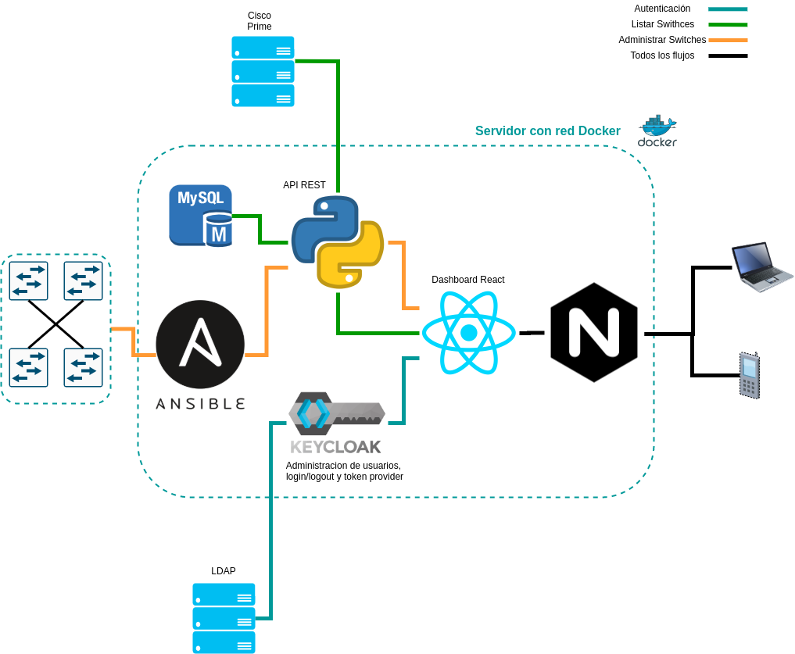

# CTMSG - Switch Manager <!-- omit in toc -->

- [Descripción general](#descripción-general)
- [Prerequisitos](#prerequisitos)
- [Inicializar proyecto](#inicializar-proyecto)
- [Estructura del repositorio (directorio) principal](#estructura-del-repositorio-directorio-principal)
- [Descripción de la composición de hardware/contenedores y flujos de comunicación](#descripción-de-la-composición-de-hardwarecontenedores-y-flujos-de-comunicación)
  - [Descripción de los flujos principales](#descripción-de-los-flujos-principales)

- [Implementación desde 0](docs/FIRST_DEPLOY.md)
- [Crear respaldos](docs/BACKUPS.md)
- [Mantenimiento](docs/MAINTENANCE.md)
- [Diagnostico de problemas](docs/TRUBLESHOOTING_TIPS.md)
- [Manual de usuario](docs/USER_MANUAL.md)

## Descripción general

La solucion al cliente se basa en proveer un dashboard web para la administración de la red de switches.
En cuanto a la administracion de switches, el proyecto permite listarlos mediante el switch manager y la base de datos (switches agregados de forma manual mediante el dashboard).
Ademas permite interactuar con esta lista de switches usando dos roles

- Administrador
- Operador

Con el rol administrador se puede indicar que switches se pueden operar y cuales no con el rol de operador.

Tanto con el rol de operador como con el de administrador, se puede listar las interfaces de cada switch, chequear algunas propiedades de las mismas y resetear las interfaces que dependiendo el modo de operación son
permitidas.
Ademas permite a ambos usuarios hacer busquedas por MAC, tanto en un switch como en conjunto de estos (agrupados por edificios segun prefijos tomados de Cisco Prime) y una vez encontrada la interface que se enncuentra esa MAC, el sistema permite ver información de la misma o resetearla.

## Prerequisitos

El servidor debe contar con

- Ubuntu 18.04 - x64
- [GNU Make - por defecto in ubuntu server](https://www.gnu.org/software/make/)
- [Docker >19.03](https://docs.docker.com/engine/install/ubuntu/)
- [Docker-compose >1.26](https://docs.docker.com/compose/install/)
- [Node >12 y NPM](https://www.digitalocean.com/community/tutorials/como-instalar-node-js-en-ubuntu-18-04-es)
- [python2 o python3 con docker instalado](https://docs.ansible.com/ansible/latest/scenario_guides/guide_docker.html)
- [ansible >2.9](https://docs.ansible.com/ansible/latest/installation_guide/intro_installation.html)
- [git](https://git-scm.com/book/en/v2/Getting-Started-Installing-Git)

## Inicializar proyecto

Para simplificar la gestíon de estos proyectos se utilizará la herramienta
[`meta`](https://github.com/mateodelnorte/meta). Para utilizarla, es necesario
instalarla con `npm`.

```bash
npm install -g meta
```

Luego, clonamos este repositorio, corriendo con `meta git clone`:

```bash
meta git clone https://github.com/conatel-i-d/sm
```

## Estructura del repositorio (directorio) principal

Los componentes de la misma están concentrados en 4 repositorios
independientes:

1. `sm-api`: API para la interacción entre los clientes y AWX.
2. `sm-dashboard`: Dashboard para la administración de la aplicación.
3. `sm-infrastructure`: Archivos, scripts, y playbooks necesarios para levantar
   ambientes de producción y testing de la aplicación.
4. `sm-playbooks`: Playbooks que consume el AWX para interactuar con los
   equipos de red de los clientes.
5. `docs`: Carpeta que contiene imagenes y archivos Markdown con la docummentación
6. `Readme.md`: Archivo principal de documentación

## Descripción de la composición de hardware/contenedores y flujos de comunicación



### Descripción de los flujos principales

1. Autenticación: Cuando el usario conecta a la URL del servidor de la aplicacción si estamos en dev se conecta al puerto 80, sino se redirije al puerto 443 y se negocian certificados, una vez establecida la comunicacion, el servidor nginx devuelve la APP de React que automaticamente redirige a Keycloak donde se procede a la autenticacíon, si la autenticación se logra con exito, keycloak redirige nuevamente al dashboard react brinadnonos un json web token que nos servira para manetenr la sesion y cargar los roles del usuario. Una vez autenticado ya sea como administrador u operador ya se puede interactuar con la api.
2. Lista switches: desde el dashboard se envia un request HTTP a la API REST para solicitar la lista de switches, los switches a listas pueden haber sido agregado de forma manual o extraidos del Cisco Prime, por lo tanto el backen hace una solicitud a la API del CISCO PRIME para listar los switches que estan ahi y combina los que estaban en la base para agregarles algunas propiedades, ademas agerga de la base de datos los que fueron agregados manualmente.
3. Administrar swithces: cada vez que se quiere administrar un switch (ya sea listar interfaces, buscar una mac o resetear una interface), el flujo es desde el dashboard solicitar a la API la acción a realizar sobre el switch o grupo de switches a operar, la api se conecta de forma asíncrona con el AWX (quien se encarga de la conexion a los switches y la automatización de los procesos con la infraestructura), el tower procesa la solicitud y luego devuelve la respuesta a la API, una vez que la API recibe todas las respuestas del AWX, procesa la respuesta para el dashboard y devuelve el request con los datos necesarios.
