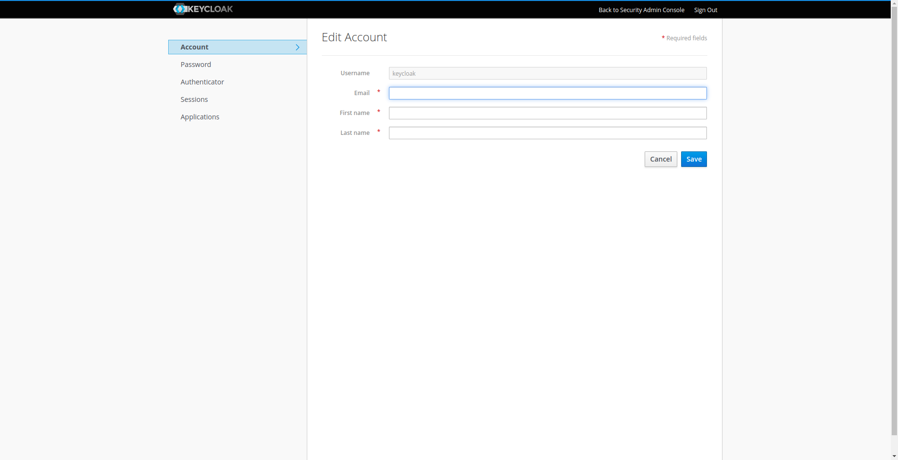

# Tips para mantenimiento y cambios de claves <!-- omit in toc -->

- [Actualización de certificados https](#actualización-de-certificados-https)
- [Cambio de credenciales](#cambio-de-credenciales)
  - [Cambio de password Keycloak](#cambio-de-password-keycloak)
  - [Cambio de password AWX](#cambio-de-password-awx)
  - [Cambio de credenciales LDAP](#cambio-de-credenciales-ldap)
  - [Cambio de credenciales CISCO PRIME](#cambio-de-credenciales-cisco-prime)
  - [Cambio de credenciales para conexión SSH con los SWITCHES](#cambio-de-credenciales-para-conexión-ssh-con-los-switches)

## Actualización de certificados https

Para actualizar los certificados https, es necesario acceder al directorio configurado en la variable `certificates_folder` por defecto es `sm-infrastructure/lib/certificates` y pegar los nuevos certificados con el nombre establecido en la variable `public_domain` agregando la extensión correspondiente, `.crt` o `.key`, luego estando ubicado dentro de `sm-infrastructure` ejecutar

si si se utilizaron las variables de entorno que configuran los directorios, con valores por defecto

```bash
make update_certs
```

de lo contrario ejecutar

```bash
cd <docker_compose_dir>/proxy && docker-compose up -d --force-recreate && cd - # Siendo docker_compose_dir el valor asignado a la variable de entorno con ese nombre
```

## Cambio de credenciales

### Cambio de password Keycloak

Para conectarse a el servidor de AWX es necesario acceder a la URL `https://<public_domain>/auth` observando la configuración de `public_domain`, una vez allí autenticarse con las credenciales definidad por las variables `keycloak_admin_username`, `keycloak_admin_password`.

Luego para acceder a la configuración de usuario ir a la cuenta de usuario, esquina superior derecha, luego acceder a `Manage Account` y luego es posible cambiar las configuraciones que se muestran en las imagenes.





### Cambio de password AWX

Para conectarse a el servidor de AWX es necesario acceder a la URL `https://<public_domain>:8052` observando la configuracion de `public_domain`,
una vez allí, autenticarse con el usuario y password definido por las variables `awx_admin_username` y `awx_admin_password`.
Luego podrán acceder a una pantalla similar a la siguiente y en el menu lateral acceder a Usuarios dentro de usuarios acceder a el usuario en cuestión y desde ahí se puede configurar tanto el nombre como la contraseña.


Referencia para el cambio de datos del usuario en AWX

### Cambio de credenciales LDAP

Para actualizar la configuración si se cambiaron o actualizaron las credenciales en el servidor ldap, lo que hay que hacer es acceder a `keycloak` como como se al comiendo de la [sección de cambio de password](###cambio-de-password-keycloak). Una vez ahí acceder a `User Federation`, en esa sección se verán los grupos de usuarios configurados para cargarse desde el ldap, cada grupo tiene su configuración independiente, por lo tanto si se cambiaron las credenciales habrá que cambiarlo en los tres grupos, en la [sección trubleshooting](./TRUBLESHOOTING_TIPS.md) se pueden ver algunas imágenes de como acceder y las configuraciónes posibles.

### Cambio de credenciales CISCO PRIME

Para cambiar las credenciales del cisco prime, es necesario cambiar las variables de entorno `cisco_prime_user` y
`cisco_prime_password`, estando parado dentro de `sm-infrastructure`  ejecutar

si si se utilizaron las variables de entorno que configuran los directorios, con valores por defecto

```bash
make update_api_prod_creds
```

de lo contrario ejecutar

```bash
ansible-playbook api_run.yaml --extra-vars "env=prod"
cd <docker_compose_dir>/api && docker-compose up -d --force-recreate & cd - # Siendo docker_compose_dir el valor asignado a la variable de entorno con ese nombre
```

### Cambio de credenciales para conexión SSH con los SWITCHES

Este procedimiento es Idem al [anterior](###-cambio-de-credenciales-cisco-prime), con la salvedad que las variables de entorno a cambiar son `prime_switches_ssh_pass` `prime_switches_ssh_user`, los comandos son los mismos luego de cambiar las variables.
Para que el AWX tome el cambio de clave y se conecte a los switches con el nuevo user y pass a los switches puede demorar hasta 10 minutos.
