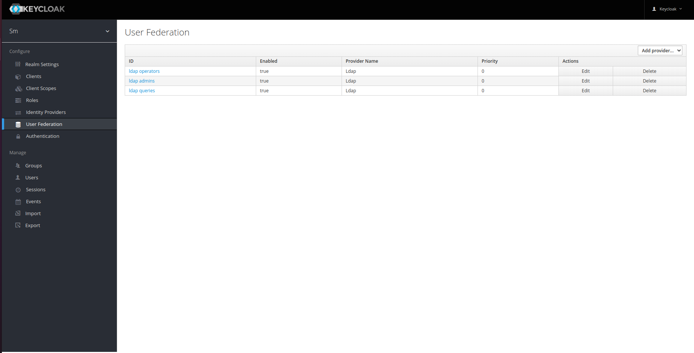

# Diagnostico de fallas

Para hacer trubleshooting es importante entender la estructura eexplicada en el [README principal](../README.md), una vez que se entienden los flujos para poder ver el estado general de los contenedores en la red docker se ejecuta

```bash
docker ps
```


en esa imagen se puede apreciar los nombres de los contenedores, el comando con el que inician, la imagen que utilizan para crearse y los puertos que cada contenedor trasladan desde la red interna docker al adaptador del host anfitrion, lo mismos representan `<ip_anfitrion>:<puerto_anfitrion> -> <puerto_contenedor>`, si aparece solo el puerto, el mismo esta expuesto por el contenedor pero solo en la red interna de docker, ademas se ve el estado de cada contenedos, si un contenedor falla lo representa en un log si la falla esta capturada, sino el mismo se resetea y esto lo podemos observar en el status de la vista general.

Luego de cada uno de estos contenedores podemos observar los `logs`, **estos son la principal fuente de diagnostico** que vamos a tener, ya que una falla en cualquiera de los servicios de va a servir aquí, para ver los logs de un contenedor en particular el comando es 

```bash
docker logs <nombre_del_contenedor>
```

Ejemplo logs del Dashboard


Ejemplo logs del Proxy


Ejemplo logs de la API


Ejemplo logs de Keycloak


En estos últimos logs de error, podemos apreciar algunos errores.
Por mas que el contenedor no se esta reiniciando ni dejo de funcionar (como se vio en la primer imagen de este documento), el mismo tiene fallas.
No se reinicia ni deja de correr, porque como se explico antes estos errores fueron tratados por el software que se corre dentro del contenedor, que los capturo e imprimio en STDERR.
Si analizamos un poco el log podemos ver que este error se da al no poder conectarse al servidor LDAP, esto debido a que saque la imagen de el keycloak corriendo en el entorno `DEV` en mi maquina local y no tenia acceso al  LDAP.

Una vez que encontramos el error, si el error no fuera por el motivo que se acaba de explicar, se puede ir a la pagina de Keycloak y ver y corregir las las configuraciones de conexión con el LDAP. Para acceder a Keycloak ir al la `https://<public_domain>/auth` autenticarse y dentro de `user federation` acceder a el grupo que falla al conectarse, a continuacion algunas imagenes que muestra posibles configuraciones




dentro de esta pagina al reconfigurar la conexión ya se puede ir chequeando paso a paso que todo funcione, nos permite verificar 

1. La conexion con el servidor
2. La autenticación con el servidor
3. La sincronizacion de los usuarios

Por ultimo otro diagnostico que puede ser interesante es verificar el funcionamiento y el resultado de los comandos ejecutados en los switches, para esto accedemos al awx, tal como se explica en [la seccion de mantenimiento](MAINTENANCE.md) en el punto `Cambio de password AWX`. Una vez conectado al awx se puede ver un historial de los trabajos ejecutados, se puede acceder a cada uno de ellos y ver los resultados de cada ejecucion en los de destino (en este caso switches).

En la siguiente imagen se ve la lista de tareas ejecutadas en mi servidor


luego al ingresar a una de reset por ejemplo


y dentro de esa de reset se ingresa a cada una de las dos task ejecutadas y a continuacion se muestra el comienzo de lo que se visualiza pero si se va bajando en el JSON se vera todos los logs que imprimio el equipo de destino al ejecutar el comando


Por ultimo un diagnostico inicial y rapido de cualquier falla que pueda apreciarse al ejecutar una acción es dentro del dashboard acceder a los logs como se explica en el [manual de usuario](USER_MANUAL.md).
