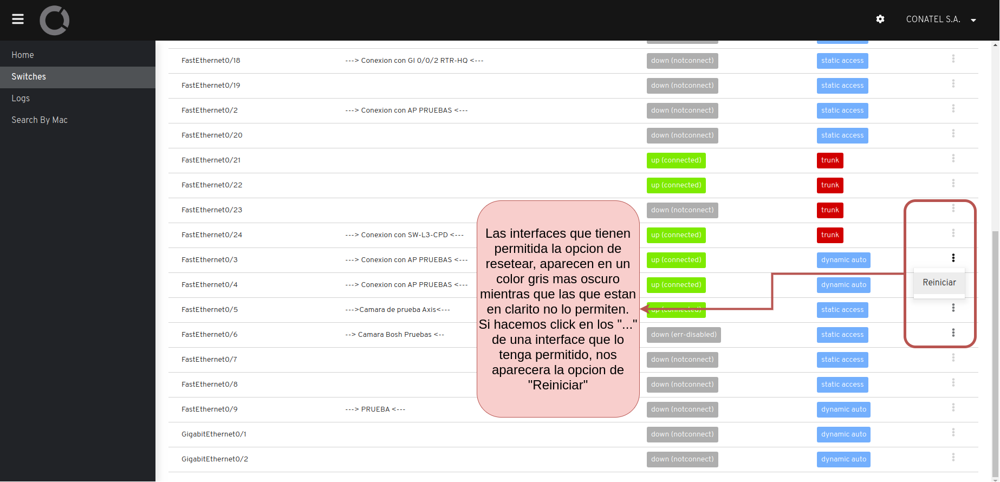
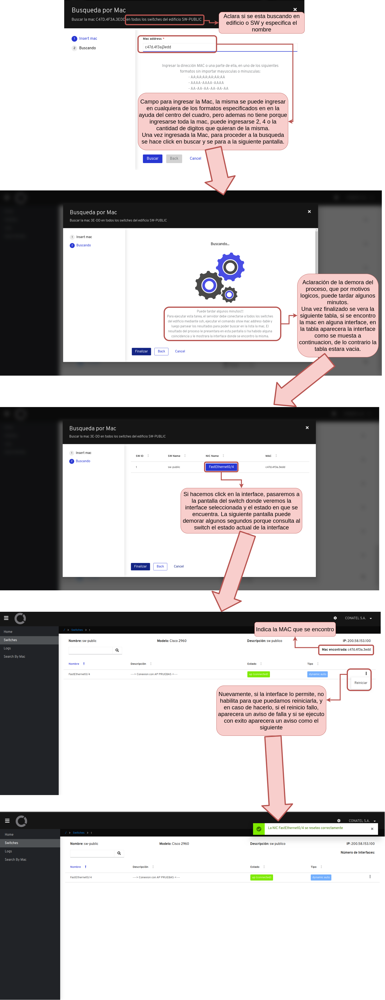

# Manual de usuario <!-- omit in toc -->
 
Una vez ingresado a la url de la aplicación lo primero que deben hacer es autenticarse, para la autenticacion deben usar su usuario y pasword empresariales.

Una vez autenticado llegaran a la pagina de `home`, haciendo click en el icono que aparece arriba a la izquierda abriran el menu

Dentro del menu como se observar hay tres secciones principales

- [Swithces](#swithces)
- [Logs](#logs)
- [Search By Mac](#search-by-mac)

## Swithces

## Logs

La idea de esta pantalla es que a nivel tecnico brinde un diagnostico inicial del comportamiento de las funcionalidades ejecutadas desde el dashboard, se puede hacer seguimiento de cada accion tomada y el resultado obtenido de la misma, ya sea error o accion ejecutada satisfactoriamente, ademas audita cual fue el usuario que solicito cada acción.

## Search By Mac

La busqueda por mac es una de las funcionalidades principales del proyecto y lo que nos permite es buscar un dispositivo por mac en un switch especifico o en multiples swithces que se encuentren en un edificio.

Una vez que ingresamos a la busqueda por mac llegaremos a la siguiente pagina

y a continuación se muestra como seria el flujo de busqueda de una MAC, hasta llegar a la interface y resetearla 

